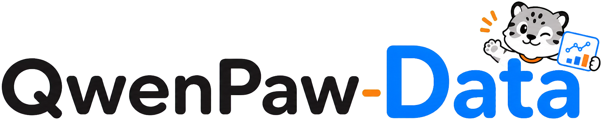
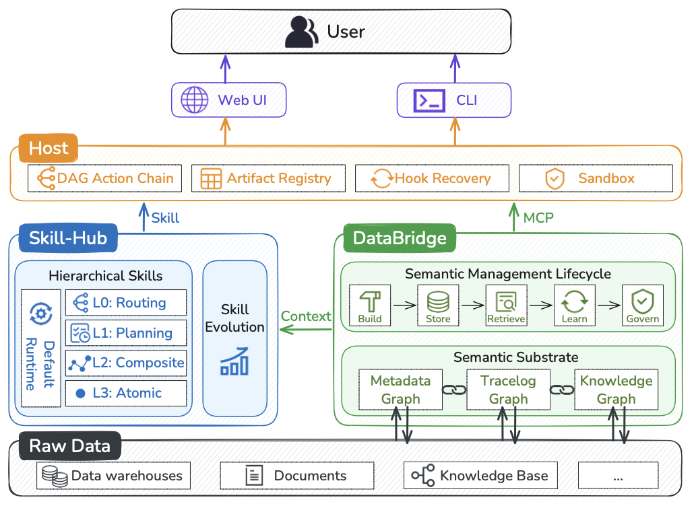
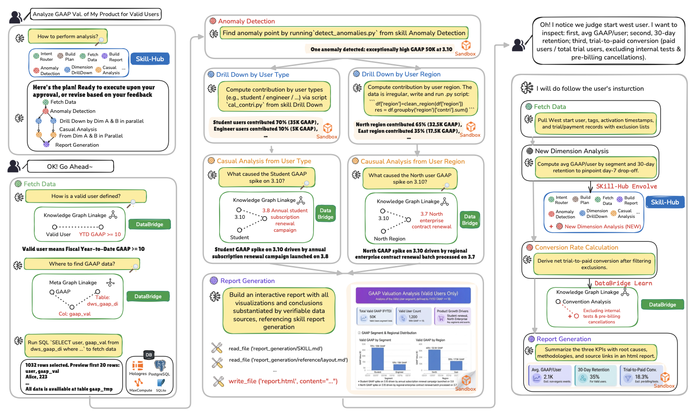

# QwenPaw-Data: Bridging Facts, Methodology, and Execution for Autonomous Enterprise Data Analytics

[英文 README](./README.md)

[](./LICENSE)
[](https://pypi.org/project/qwenpaw-data-cli/)
[](https://github.com/agentscope-ai/QwenPaw-Data/actions/workflows/ci.yml)

<p align="center">
  
</p>

**QwenPaw-Data 是一个面向企业数据分析的智能体数据系统。**

企业数据分析正在成为自主智能体的重要方向。它运行在开放、模糊且持续变化的环境中：业务概念需要锚定到正确的数据实体，分析过程需要在模糊反馈下保持可复现，长链路工作流需要在真实企业数据上执行，并保留分析产物、来源记录和人类中途干预的空间。

QwenPaw-Data 围绕**事实**、**方法**与**执行**三个核心维度组织系统能力。它将分散在数仓、看板、业务文档、交互日志和历史任务中的异构企业资产整理为可治理、可演进的分析上下文，并将自然语言请求转化为端到端工作流，覆盖数据理解、数据获取、数据分析、报告生成和辅助决策。

完整的系统级说明可参考 [技术报告](https://arxiv.org/pdf/2607.11019)。

## 核心思路

QwenPaw-Data 的设计原则是按照智能体原生数据分析系统必须回答的核心问题来拆解企业数据分析：

- **应该使用哪些事实**：智能体需要围绕业务概念、指标、维度、表结构、血缘和历史上下文获取可治理证据。
- **应该如何分析**：智能体需要可复用的分析方法，减少每次请求中的临场推理。
- **应该如何执行**：智能体需要一个可控制的运行时来承载长链路、以分析产物为中心的工作流。

QwenPaw-Data 通过三个协同子系统实现这一拆解：

| 子系统 | 角色 | 管理内容 |
| --- | --- | --- |
| **DataBridge** | 事实锚定 | 元数据、业务知识、历史轨迹、指标定义、数据血缘和任务相关证据。 |
| **Skill-Hub** | 方法编排 | 路由、规划、流程和原子分析技能，以及相关参考资料、脚本和质量要求。 |
| **Host** | 执行控制 | DAG 规划、子智能体调度、工具调用、默认在容器工作区中执行、产物登记、反思和恢复。 |

三个子系统共同提供四类数据分析能力：可信事实锚定、标准化分析方法、可控制的长链路执行，以及可自演进的数据资产。

## 架构概览

<p align="center">
  
</p>

DataBridge 将分散的企业信息源转化为可治理的语义基底。元数据图（Metadata Graph）描述数据库、表、列、指标、维度和血缘；知识图（Knowledge Graph）捕获业务实体、定义、规则和组织上下文；轨迹图（Trace Graph）记录任务轨迹、工具使用、中间产物、用户反馈和可复用经验。

Skill-Hub 位于这一语义基底之上，作为方法子系统组织可复用技能。它覆盖从粗粒度任务路由和任务规划，到工作流级完整流程，再到异常检测、维度下钻、归因、可视化和证据总结等原子分析操作，形成可复用的方法资产。

Host 将事实和方法资产转化为可执行过程。它读取技能规范、参考资料和脚本，将它们转化为 DAG 执行图，并行调度独立分支，提供 SQL、Python、文件操作和报告构建工具，并记录中间产物和最终产物。

## 端到端示例

下面通过一个典型例子介绍系统：**“分析产品 X 的有效用户平均 GAAP 值”**。

<p align="center">
  
</p>

**规划。** Host 查询 Skill-Hub，选择相关路由和规划技能，并将请求拆解为 DAG 形态的工作流：获取数据、检测异常、按用户类型和地区并行下钻、开展原因分析、生成最终报告。DataBridge 可以在这一阶段提供高层语义提示，约束计划中应考虑的指标、实体和维度。

**数据获取。** DataBridge 通过知识图解析“有效用户”等业务术语，并通过元数据图定位 GAAP 指标，将逻辑定义连接到物理表和列。Host 调用相应的数据访问工具，并将结果数据集登记为分析产物。

**分析。** Host 按照 Skill-Hub 中可复用的技能资产执行异常检测、维度下钻、贡献度计算和原因分析。归因过程中，DataBridge 继续从知识和历史轨迹中提供可信证据，使指标变化能够连接到业务事件、历史记录或已知规则。

**报告生成。** Host 使用报告生成技能，将发现、图表、方法和来源链接组织成可用于决策的报告。DataBridge 提供来源和过程记录，使每个核心结论都能连接回指标定义、取回数据和生成该结论的分析路径。

**自我演进。** 任务在报告交付后继续沉淀。执行轨迹、用户反馈、新分析需求和已确认的指标定义会成为 DataBridge 和 Skill-Hub 的更新信号，使一次完成的任务转化为下一次相似分析可复用的经验。

## 支持的分析场景

QwenPaw-Data 面向数据团队日常处理的严肃分析任务，包括：

- **业务监控与异常诊断**：追踪 DAU、收入、转化率等核心指标，在指标异常时定位由哪个区域、渠道或分群驱动。
- **趋势与增长分析**：分析访问、留存或转化趋势，识别转折点，并归因背后的变化。
- **用户与交互洞察**：挖掘对话和行为日志，理解用户意图、用户需求及其变化趋势。
- **周期性业务报告**：从数据获取到成稿，生成产品或业务线的月报、季报等决策报告。
- **临时深度分析**：回答开放业务问题，通过多维拆解和贡献归因支持业务判断。

## 接入方式

QwenPaw-Data 当前以 DataBridge 作为本地管理面；独立 CLI Host 已在仓库中提供，并持续演进为主要执行入口。

| 模式 | 用途 | 典型用户 | 运行形态 |
| --- | --- | --- | --- |
| **DataBridge UI** | 管理图记忆、语义配置及相关 DataBridge 资产 | 分析师、平台运营 | 本地管理界面，后端对接 DataBridge API。 |
| **CLI** | 平台集成、二次开发和本地自动化 | 开发者、平台团队 | 通过 `qwenpaw-data-cli` 提供意图理解、任务规划和工作流执行等能力。 |

## 项目结构

QwenPaw-Data 采用 Python + uv 工作区的单仓库结构。

当前仓库主要包含：

- **DataBridge**：管理元数据、业务知识、历史轨迹、图记忆及其管理界面。
- **Host Core / CLI**：共享 Host 编排能力与 CLI 执行入口。
- **数据分析技能**：可复用的分析技能及配套资源。

```text
packages/                  # Python 包
docs/                      # 架构、发布与图记忆文档
scripts/                   # 环境配置、启动与端到端脚本
examples/                  # 可执行本地演示数据与确定性冒烟测试
assets/                    # 品牌与文档资源
```

## 快速开始：从 clone 到第一个数据任务

### 通过 PyPI 安装

Python 包已发布到 PyPI：

```bash
pip install qwenpaw-data-cli        # `qwenpaw-data` 命令 + 宿主运行时
pip install qwenpaw-data-context    # 以库形式使用 DataBridge 后端
```

`pip install qwenpaw-data-cli` 适合已运行 DataBridge 服务的平台集成场景。完整的
本地体验（DataBridge UI、演示数据与本地服务）请使用下面的源码方式。

### 0. 准备本地依赖

支持 Windows 11、macOS 和 Linux。开始前请安装：

- Git
- [uv](https://docs.astral.sh/uv/getting-started/installation/)
- Node.js 22.22 或更高版本（Node 22 LTS）与 npm
- Docker Desktop 或包含 Docker Compose 的 Docker Engine

DataBridge 默认使用 Python 3.12；如果本机没有，`uv` 会在初始化时准备对应解释器。启动本地服务前，请先启动 Docker Desktop/Engine。
Windows 用户需要 PowerShell 7，并将 Docker Desktop 配置为 Linux
containers。Native Windows 流程已纳入 CI；如果本机 Docker 或网络环境不兼容，
推荐使用 WSL2。详见 [`docs/WINDOWS.md`](docs/WINDOWS.md)。

### 1. Clone 仓库并创建本地配置

```bash
git clone https://github.com/agentscope-ai/QwenPaw-Data.git
cd QwenPaw-Data
cp .env.example .env
```

```powershell
git clone https://github.com/agentscope-ai/QwenPaw-Data.git
Set-Location QwenPaw-Data
Copy-Item .env.example .env
```

所有本地配置都写入根目录 `.env`。不要提交包含密钥的 `.env`。
请将 `NEO4J_PASSWORD=YOUR_PASSWORD` 替换为本地 Neo4j 实例的密码。

### 2. 配置下载镜像和模型

国内网络建议在 `.env` 中添加一个镜像配置，例如：

```bash
UV_DEFAULT_INDEX=https://mirrors.aliyun.com/pypi/simple/
```

也可以使用清华镜像：

```bash
UV_DEFAULT_INDEX=https://pypi.tuna.tsinghua.edu.cn/simple
```

然后填写 DataBridge 与 QwenPaw Data CLI 共用的模型配置。CLI 默认复用这组
OpenAI-compatible 配置；只有需要为 CLI 指定不同模型时，才配置
`QWENPAW_DATA_MODEL_*`：

```bash
OPENAI_API_KEY=replace-with-your-api-key
OPENAI_BASE_URL=https://dashscope.aliyuncs.com/compatible-mode/v1
LLM_MODEL=qwen3.7-max
EMBED_MODEL=text-embedding-v3
EMBED_DIM=1024

# 可选的 CLI 专用覆盖配置：
# QWENPAW_DATA_MODEL_PROVIDER=openai
# QWENPAW_DATA_MODEL_NAME=qwen3.7-max
# QWENPAW_DATA_MODEL_API_KEY=replace-with-your-api-key
# QWENPAW_DATA_MODEL_BASE_URL=https://dashscope.aliyuncs.com/compatible-mode/v1
```

### 3. 初始化本地环境

```bash
# macOS / Linux
python3 scripts/init_local.py
```

```powershell
.\scripts\init_local.ps1
```

初始化脚本会：

1. 创建 `packages/qwenpaw-data-context/.venv`，安装 DataBridge 后端依赖并构建管理界面。
2. 从仓库提交的 `uv.lock` 导出固定版本及 hash，通过 `UV_DEFAULT_INDEX` 指定的镜像安装到根目录 `.venv`，再以 editable 模式安装所有 workspace 包。
3. 使用临时源文件，将名为 `databridge` 的 MCP 客户端导入 `${QWENPAW_DATA_HOME:-~/.qwenpaw-data}/host/workspace/.mcp`。
4. 在不覆盖已有命令的前提下发布 `qwenpaw-data`：macOS/Linux 默认写入
   `${QWENPAW_DATA_CLI_BIN_DIR:-~/.local/bin}`，Windows 默认生成
   `%LOCALAPPDATA%\QwenPaw Data\bin\qwenpaw_data.cmd`。

镜像只影响下载地址，不会重写或删除 `uv.lock`，初始化后仓库也不会因此产生锁文件变更。首次初始化不要使用 `--skip-build`；只有已经存在前端构建产物时才向初始化命令传入 `--skip-build`。

如果其他系统负责管理默认 workspace 的 MCP 配置，向初始化命令传入 `--skip-mcp-config`。

Windows 用户需要在当前 PowerShell 终端中启用初始化程序生成的命令：

```powershell
$QwenPawDataBin = Join-Path $env:LOCALAPPDATA "QwenPaw Data\bin"
$env:Path = "$QwenPawDataBin;$env:Path"
Get-Command qwenpaw-data
```

如何永久加入用户 `Path` 以及干净机器验收步骤见
[Windows 原生走查文档](docs/WINDOWS.md)。

### 4. 在终端 A 启动本地服务

```bash
# macOS / Linux
python3 scripts/start_local.py
```

```powershell
.\scripts\start_local.ps1
```

该命令会启动本地 Neo4j、DataBridge API 和管理界面，并持续占用当前终端。如果 DataBridge UI 端口 `3000` 或 API 端口 `8765` 已被占用，它会安全失败，不会终止无关进程。

默认地址：

```text
DataBridge UI:   http://localhost:3000
DataBridge API:  http://localhost:8765
DataBridge 文档: http://localhost:8765/docs
```

### 5. 在终端 B 初始化内置 demo

仓库包含确定性的 PostgreSQL 数据、语义配置工作簿和知识图谱文档。执行：

```bash
# macOS / Linux
examples/init_demo.sh --register
```

```powershell
# Windows PowerShell
.\examples\init_demo.ps1 -Register
```

命令可重复运行，会生成 475 行合成数据并创建固定数据源
`postgresql-demo-gaap`。它不会自动上传知识图谱文档，因为该步骤会调用
`.env` 中配置的模型。

### 6. 构建 demo 图谱

打开 `http://localhost:3000`：

1. 在 **Semantic Weaving** 中选择 `Demo PG - GAAP use case`，提交一次
   `FULL` weave。
2. 在 **KG Docs Management** 中上传 `examples/demo_kg_doc.docx`。
3. 等待文档状态变为 `ready`。

如果只想在没有真实模型 API key 的情况下快速走查，可以跳过图谱构建，使用
下文的确定性 smoke test。

### 7. 验证 CLI

```bash
command -v qwenpaw-data
qwenpaw-data datasource list
```

```powershell
Get-Command qwenpaw-data
qwenpaw-data datasource list
```

命令应解析到初始化程序发布的 launcher，`datasource list` 应包含
`postgresql-demo-gaap`。CLI
会自动加载仓库根目录 `.env`；只有需要使用其他 dotenv 文件时才设置
`QWENPAW_DATA_ENV_FILE`。

### 8. 执行真实数据任务

建议第一次使用非流式模式，便于查看完整执行摘要：

```bash
qwenpaw-data run \
  --no-stream \
  --datasource-id postgresql-demo-gaap \
  "分析 2026 年 3 月 product X 有效用户的平均 GAAP 值，展示时间趋势，并结合相关 KG 事件解释异常峰值"
```

```powershell
qwenpaw-data run --no-stream --datasource-id postgresql-demo-gaap "分析 2026 年 3 月 product X 有效用户的平均 GAAP 值，展示时间趋势，并结合相关 KG 事件解释异常峰值"
```

预期峰值出现在 2026-03-10，有效用户平均 GAAP 值约为 `45.89`。默认产物
目录在 macOS/Linux 上是
`${QWENPAW_DATA_HOME:-~/.qwenpaw-data}/host/workspace`，在 Windows 上是
`$HOME\.qwenpaw-data\host\workspace`；`QWENPAW_DATA_HOME` 可覆盖该位置。

如需在不使用真实模型 API key 的情况下做确定性端到端走查：

```bash
# macOS / Linux
examples/init_demo.sh
uv run python examples/smoke_test.py
```

```powershell
# Windows PowerShell
.\examples\init_demo.ps1
uv run python .\examples\smoke_test.py
```

直接 SQL、清理和故障排查命令见 [完整 demo 文档](examples/README.md)。

## 常用脚本

```bash
# 复用已有前端构建产物
python3 scripts/init_local.py --skip-build

# 初始化但不发布 qwenpaw-data 命令软链接
python3 scripts/init_local.py --skip-cli-link

# 启动 DataBridge 服务（默认包含 3000 管理界面和 8765 API）
scripts/init_databridge.sh
scripts/start_databridge.sh

# 只启动 DataBridge API
scripts/start_databridge.sh --skip-frontend
```

Windows 可向 `init_local.ps1` 或 `start_local.ps1` 传入相同参数；本段的
DataBridge-only `.sh` 脚本仅作为 macOS/Linux 便捷入口。

## 工作区隔离

智能体工具在工作区内执行，后端按次选择（`--workspace` 参数或
`QWENPAW_DATA_WORKSPACE` 环境变量，默认 `docker`）：

| 后端 | 隔离级别 | 依赖 | 适用场景 |
|------|---------|------|---------|
| `docker`（默认） | 容器级工作区隔离：全部工具在每会话独立容器内执行，仅挂载任务工作区 | 运行中的 Docker daemon | 正常任务执行 |
| `local` | 文件工具限定路径，但 shell 仍以宿主机用户权限执行 | 显式指定 `--workspace local` | 仅限可信开发或紧急排障 |

```bash
# 先自检环境（Docker daemon、Neo4j、DataBridge API）
qwenpaw-data doctor

# Docker 是默认 workspace
qwenpaw-data run --datasource-id postgresql-demo-gaap "..."

# 显式使用不安全的宿主机执行
qwenpaw-data run --workspace local "..."
```

权限策略默认值为 `auto`（可通过 `--permission-mode` 或
`QWENPAW_DATA_PERMISSION_MODE` 覆盖）。Docker 后端使用 `bypass`，因为每次运行的
容器本身就是执行边界。交互式本地 CLI 使用 `accept_edits`：任务工作区内的
文件编辑被允许，更高风险调用需要终端确认。无人值守本地执行使用
`dont_ask`，会拒绝原本需要确认的调用。子智能体无法独立请求确认，因此
此类调用默认拒绝。

`docker` 后端说明：

- 首次使用时构建镜像（`python:3.11-slim` + 分析栈：pandas、numpy、
  matplotlib、openpyxl），可用 `QWENPAW_DATA_DOCKER_BASE_IMAGE` /
  `QWENPAW_DATA_DOCKER_EXTRA_PIP` 定制。
- 容器通过 `host.docker.internal` 访问宿主机服务（DataBridge），可用
  `QWENPAW_DATA_DOCKER_HOST_ALIAS` 覆盖；任务结束后容器自动停止并移除。
- Docker 命令运行在独立进程组中；超时或取消会触发 TERM/KILL 清理；若
  清理本身失败，QwenPaw Data 会关闭工作区容器，而不是留下未知进程。
- macOS 推荐用 [colima](https://github.com/abiosoft/colima) 提供免授权、
  无人值守的 Docker daemon：`brew install colima docker && colima start`。
- 当前边界即容器本身：资源限制（CPU/内存/进程数）、出网策略、
  非 root 运行尚未施加（在 roadmap 中），请勿将 `docker` 后端视为
  加固级沙箱。

## 安全模型与已知限制

QwenPaw-Data 面向**本地优先、单用户部署**设计。将任何服务暴露到
`127.0.0.1` 之外前，请先阅读本节。

- **网络**：所有服务默认仅绑定 `127.0.0.1`。对外暴露（`--host 0.0.0.0`、
  `FRONTEND_HOST`、`QWENPAW_DATA_MCP_HOST`）需显式指定；暴露前请先设置
  `QWENPAW_DATA_API_TOKEN` 或带 scope 的 `QWENPAW_DATA_API_KEYS`，使 DataBridge REST
  与 HTTP MCP 强制 Bearer token 认证，并用 `QWENPAW_DATA_CORS_ORIGINS` 限制
  精确可信来源。
- **执行**：Host 默认在每次运行独立的 **Docker** 工作区中执行智能体工具。
  显式 `--workspace local` 本地执行入口会在你的机器上以当前用户权限执行
  shell 命令，**不是沙箱**。文件/搜索工具仍限制在任务工作区内，超时或
  取消命令在本地和 Docker 工作区中都会整组终止。本地 PowerShell/Bash 在
  权限批准后仍能执行任意宿主机用户操作。权限策略是工作区感知的：Docker
  在容器边界内默认 `bypass`；交互式本地运行使用 `accept_edits` 并带
  终端确认；无人值守本地运行使用 `dont_ask` 并默认拒绝确认类调用。这
  并不意味着 Docker 后端是加固沙箱；其资源和网络限制仍如上文所述。
- **授权**：API key 可分别授予 `query`、`write`、`manage`、
  `credentials:manage`；旧 `QWENPAW_DATA_API_TOKEN` 作为全权限兼容键保留。
  使用 scoped key 的客户端应设置 `QWENPAW_DATA_CLIENT_API_TOKEN`；所有 API 路由
  默认拒绝，必须显式归类后才能访问。这是 API key 授权，并非多用户
  身份/RBAC 系统。
- **浏览器与滥用防护**：不安全的浏览器请求会根据精确 CORS/Origin
  白名单和 Fetch Metadata 进行检查；认证失败按客户端进入惩罚窗口，
  认证后的请求按 principal/scope 做令牌桶限流。
  高权限操作，以及 Host、认证、授权、CSRF 和限流拒绝，以不含请求体的
  JSON 写入 `security_audit.jsonl`；只有 `QWENPAW_DATA_TRUSTED_PROXIES`
  显式配置的代理才信任转发客户端 IP。
  standalone HTTP MCP 同样复用这些入口防护。
  限流状态只在当前进程内共享；多 worker 或水平扩容部署需在网关或应用层
  使用共享限流器。
- **范围**：导入任务状态和预览/确认计划使用进程安全的 SQLite job store，
  提供 TTL、幂等键、租约、有限重试和重启恢复。服务重启后，中断的进程内
  任务会被标记为失败，而不会静默消失；目前只有 embedding rebuild 任务
  支持自动续跑。Native Windows 的支持范围与验证边界见
  `docs/WINDOWS.md`；漏洞披露方式见 `SECURITY.md`。

如需在 `QWENPAW_DATA_API_KEYS` 中只保存 token 摘要，可执行：

```bash
printf %s 'your-long-random-token' | shasum -a 256
```

运维与发布参考：

- [资源治理](./docs/RESOURCE_GOVERNANCE.md)
- [兼容性策略](./docs/COMPATIBILITY.md)
- [发布流程与公开历史边界](./docs/RELEASING.md)
- [安全策略](./SECURITY.md)
- [支持渠道与版本策略](./SUPPORT.md)
- [变更日志](./CHANGELOG.md)

## 开源许可

QwenPaw-Data 采用 [Apache License 2.0](./LICENSE) 开源。
第三方声明见 [NOTICE](./NOTICE)，参与贡献见 [CONTRIBUTING.md](./CONTRIBUTING.md)。
