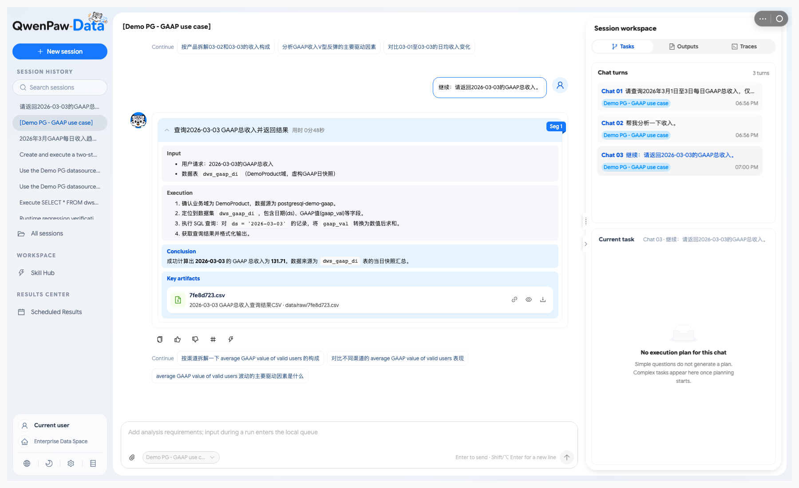
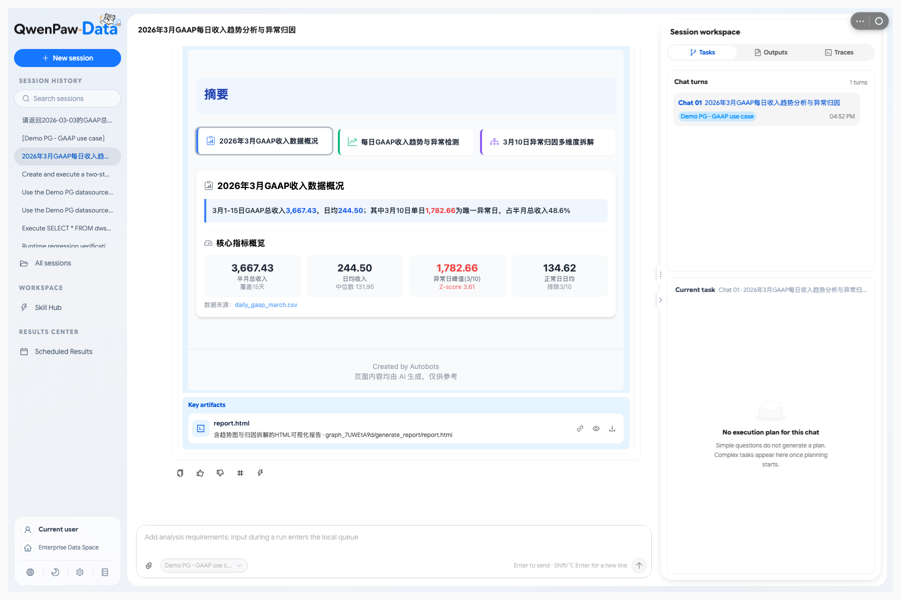
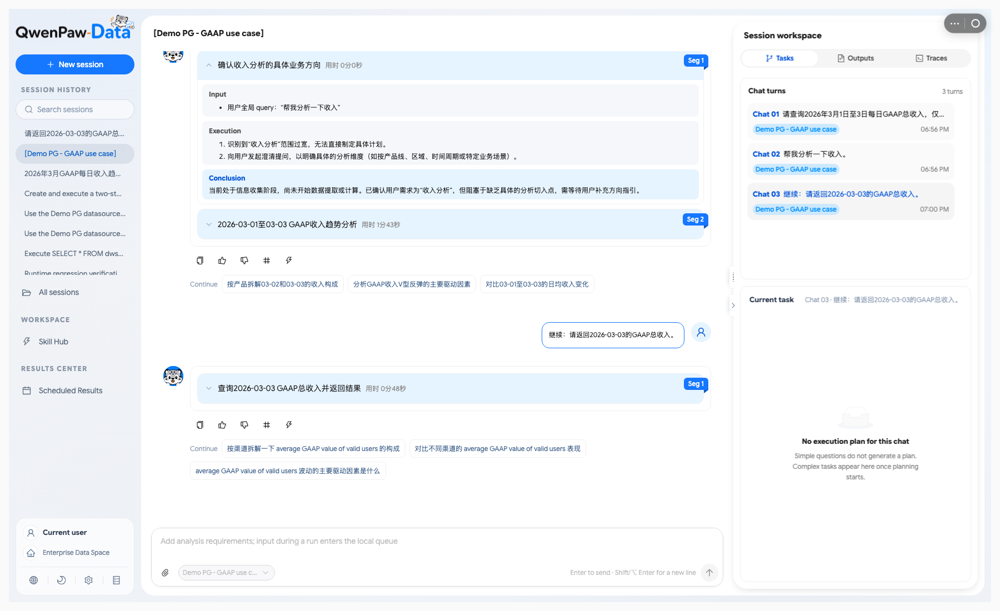
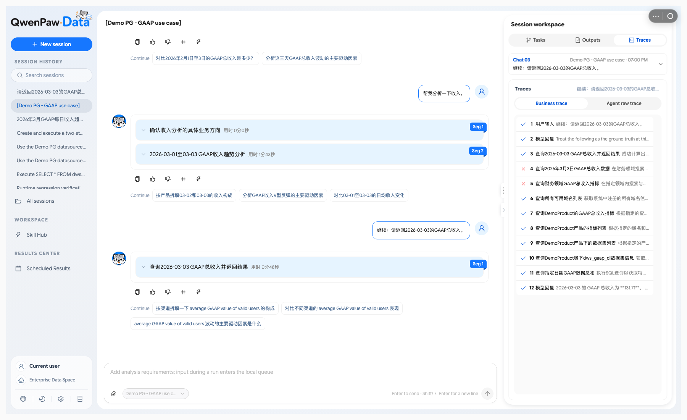
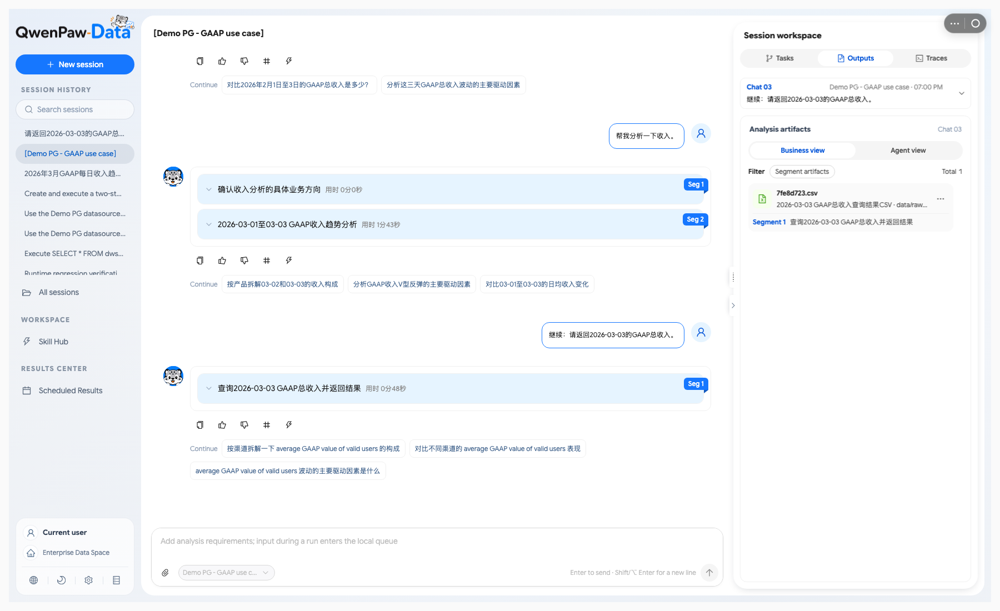

# QwenPaw Data App 0.3.0 — 发布预告

[English](QWENPAW_APP.md) · [项目介绍](../README_ZH.md) ·
[集成 PR #7637](https://github.com/agentscope-ai/QwenPaw/pull/7637)

> **计划发布的 App 版本 · 发布日期待定。**
> 截至 2026-09-15，集成正在 #7637 中评审，尚未合并。

即将推出的 QwenPaw Data App 将完整的数据分析流程带入 QwenPaw：从选择数据源、提出业务问题、
补充澄清，到跟进执行、阅读报告和继续追问，在同一个工作环境中推进分析。

QwenPaw 用户将获得专业的数据分析工作台，也可以从渠道会话进入分析。
QwenPaw 提供应用生命周期、宿主身份认证、渠道和通知；QwenPaw-Data 提供语义接地、
分析技能、执行能力与 Data Console。Engine 仍可独立运行，QwenPaw 是可选的宿主。

*分析工作台：问题、执行步骤、结论和结果文件同屏可见。本页截图来自预览构建，使用 GAAP 演示数据。*

## 本次亮点

- **完整的分析工作台。** 内嵌 Data Console 串联数据源选择、分析会话、执行轨迹和产物，
  让用户能够在业务上下文中查看分析过程与结果。
- **可交互的分析过程。** 跟进流式进度、回答澄清问题、取消运行中的分析，
  并通过后续追问继续深入问题。
- **报告与结论一起阅读。** 生成的 HTML 报告可在分析结论附近直接预览，
  同时保留产物查看与下载入口。
- **从 QwenPaw 渠道进入分析。** 通过 `/data` 进入数据分析模式，使用 `/datasource`
  选择数据源；桥接层保持会话映射，传递澄清、结果及产物通知。
- **托管或外部部署。** 可由 App 管理 Engine 和 Context 服务，
  也可连接独立运维的外部服务。

以上能力对应 #7637 中的 App 更新；实际可用性取决于安装的 QwenPaw App 构建版本。

## 从业务问题到分析报告

以 **“分析产品 X 三月份的表现，并解释变化原因”** 为例：

1. 在 Data 工作台选择已注册的数据源；也可以在支持的 QwenPaw 渠道会话中输入 `/data`，
   再通过 `/datasource` 选择数据源。
2. 提出业务问题，按需补充指标口径和分析范围。
3. 跟进分析过程：DataBridge 解析业务概念，Engine 执行分析工作；需要时可取消任务。
4. 在工作台阅读结论与生成的报告、查看结果文件，再通过追问继续分析。
   渠道用户通过桥接接收结果和产物通知。

*报告预览：在当前会话内阅读生成的 GAAP 报告，下方 Key artifacts 保留 `report.html` 的查看和下载入口。*

更多界面：澄清与追问、执行轨迹、产物列表

*澄清与追问：问题范围不明确时说明需要补充的信息，并通过后续问题继续推进分析。*

*业务轨迹：在分析会话旁查看执行链路，也能定位未成功的步骤。*

*产物列表：按会话和分析段定位生成的结果文件。*

## 模型、数据源与安装入口

预览版本使用 Data Console 已有的配置入口：

| 配置内容 | 入口 |
| --- | --- |
| 分析智能体的模型提供商、凭据、激活模型和运行参数 | Data Console → 设置 → Agent Configuration（智能体配置） |
| DataBridge 语义服务模型、Embedding 和 Neo4j | Data Console → 设置 → DataBridge Configuration（数据底座配置） |
| SQL 数据源连接 | Data Bridge → Data Sources，在关联的 Context 控制台管理 |

SQL 连接保存在 DataBridge 的数据源注册表中。保存 Neo4j 或模型设置不会创建 SQL 数据源，
也不会把 SQL 凭据写入 `.env`。语义服务模型和分析智能体模型分别承担不同职责。

App 源码及安装指南位于 **QwenPaw** 仓库。以下链接固定到 PR 的 `0b64503d` 源码快照：

- [App 中文说明与配置指南](https://github.com/cyruszhang/QwenPaw/blob/0b64503d2ada70f1b3842ebb7f3f4e13fff46997/plugins/apps/qwenpaw-data/README_ZH.md)
- [App English README](https://github.com/cyruszhang/QwenPaw/blob/0b64503d2ada70f1b3842ebb7f3f4e13fff46997/plugins/apps/qwenpaw-data/README.md)
- [App 源码快照](https://github.com/cyruszhang/QwenPaw/tree/0b64503d2ada70f1b3842ebb7f3f4e13fff46997/plugins/apps/qwenpaw-data)
- [QwenPaw 项目](https://github.com/agentscope-ai/QwenPaw)
- [独立 Engine HTTP/SSE 部署](../packages/qwenpaw-data-host-core/README.md#headless-service-optional-service-extra)

体验预览版本需要使用包含 #7637 的 QwenPaw 构建，并按 App 指南完成配置。
安装 Python 运行时包提供的是服务依赖，不会替换 QwenPaw 中的 App 源码或 UI 包。

## 版本与发布状态

本预告面向即将发布的 **App** 更新。Engine 的 `v0.3.0` 和 `v0.3.1` 已经发布。

| 组件 | 当前状态 | 详情 |
| --- | --- | --- |
| QwenPaw Data App 0.3.0 | 计划发布；集成评审中，发布日期待定 | [QwenPaw #7637](https://github.com/agentscope-ai/QwenPaw/pull/7637) |
| QwenPaw-Data Engine / Context / CLI / Skills 0.3.0 | 已发布，建立统一的 0.3 运行时版本线 | [Engine 0.3.0 发布说明](https://github.com/agentscope-ai/QwenPaw-Data/releases/tag/v0.3.0) |
| QwenPaw-Data packages 0.3.1 | 已发布，增加澄清及定时任务工具，并修复执行问题 | [Engine 0.3.1 发布说明](https://github.com/agentscope-ai/QwenPaw-Data/releases/tag/v0.3.1) |

**0.3.0 是 #7637 使用的 App 计划发布名称。** 链接中的 App manifest 仍为 `0.1.2`，
正式发布前需要对齐包版本。最终发布说明将明确 App 包、支持的 QwenPaw 版本、
经过验证的 Engine 版本和安装入口。

静默命令成功反馈、终态事件前持久化等修复属于 **Engine 0.3.1**。
App 的 `>=0.3,<0.4` 依赖范围也允许安装 `0.3.0`，验证这些修复时需要核对实际包版本。

## 范围与已知限制

- **Settlement 知识沉淀尚未形成完整支持的 App 流程。** Engine 和 Console 已有相关组件，
  但候选卡片校验及确认后写回依赖公开 Context 尚未提供的 `feedback_card` 契约。
  自动生成知识卡片并写回语义层仍待后续对接；Engine 0.3.0 发布说明中的相关亮点也应按此理解。
- **PawApp vNext 属于后续工作。** Host 公共 Skill/Tool 接入、App scoped 能力契约和统一宿主配置协议，
  不计入本次 App 集成交付；当前使用上方列出的配置入口。

集成进展见 #7637；Python 包的具体变化见 [Engine changelog](../CHANGELOG.md)。
